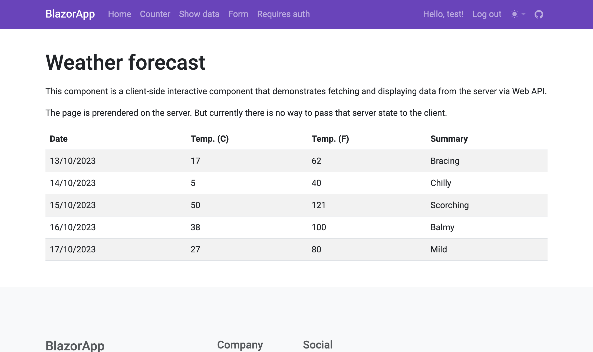

# Blazor app for .NET 8 RC 2

Demonstrates the Server-side rendered pages, and the 2 render modes for embedded interactive components: Server and WebAssembly,

Check the ``Counter`` components.

Data is stored temporary in-memory. There is no database.

https://blazor8app.graypebble-0c46426e.westus2.azurecontainerapps.io/

## Highlights

* Largely server-side rendered app - pages rendered and served by server on a request-basis.

* Showing how to handle a pre-render scenario with components in WebAssembly.

* Authentication using cookies. Custom server-side rendered pages for log-in and registering user. 

* Making HTTP request from client Web Assembly to Web API on server using cookie authentication. Sharing cookie with server app.

* UI in Bootstrap 5.3 - Basic UI. Handling light mode and dark themes. It uses JS events provided by Blazor to re-apply theme upon enhanced navigation.

## Contents

Demonstrating the following features that have been made possible in Blazor on the server by the new unified architecture:

* Server-side rendering (SSR) of page components - like "MVC Razor Pages" but with Razor components. Handy if you are building content-rich pages, that doesn't necessarily need full interactivity. Enables caching and Search-engine optimization (SEO).

* Streaming rendering (Show Data) - render the SSR page before the component has been initialized and then apply the rest once that has been loaded - in one HTTP request. No web sockets involved.

* Component Render modes: Selectively enabling interactivity on specific components (Counter) with the Server or WebAssembly render modes. There is an upcoming Auto-mode as well.

* Form model binding & validation in SSR pages.

* Authorization - Custom Login and Register pages with Server-side rendered Razor components (Instead of MVC Razor Pages).

* Open API with YAML. Swagger UI. Generated C# client.

Pre-rendering just works. If you have a server-side rendered page with interactive components then they will all be rendered together the first time.

### When to use Server-side rendering (SSR)

So why should you choose server-side rendering, over interactive client apps?

1. You are just serving content on a page that does't make significant use of interactivity: Like a blog page, or a product catalog.

2. When you want pages to be indexed by a search engine. Enabling Search-engine optimization (SEO).

And you will still have the option to embedd interactive components that will be pre-rendered together with the server-side rendered page.

## Technical details

* There are two versions of the "Show data" page -``ShowData`` (server-side), and ``FetchData`` (client-side using Web API). Workaround with "FetchData" because you can't currently route to pages in WebAssembly.

* There is a ``RenderingContext`` object that can be injected into components to check whether your component is running on the server, or on the client (WebAssembly). There is also a property telling whether prerendering is in progress.

* Added a ``Shared`` project for stuff (Models etc) that is used by both Server and Client. There is an interface called ``IWeatherForecastService`` which has two implementations: one for server and another for the client.

* Using Cookie Authentication because that is best suitable for a server-side rendered app. Any client-side component in WebAssembly also uses cookie auth when doing HTTP request to the Web API.

## Publish

Published to Azure as a Container App with GitHub Actions.

https://blazor8app.graypebble-0c46426e.westus2.azurecontainerapps.io/
